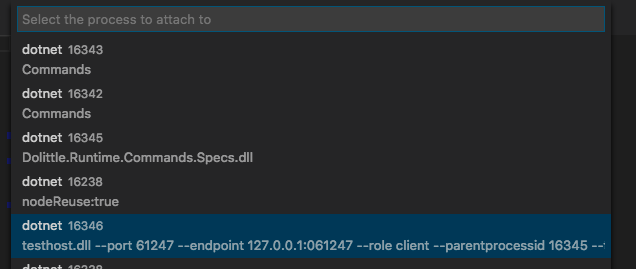

# DotNET.Build

Common build for all .NET Based projects.

## Setting up a new project

### Sub module

This project should be a Git sub-module of your project.

```shell
$ git submodule add https://github.com/dolittle/DotNET.Build.git Build
```

### CSharp Project file

In order for the assembly name to be unique, add the following:

```xml
<PropertyGroup>
    <AssemblyName>Dolittle.{full name of package}</AssemblyName>
</PropertyGroup>
```

You can also import the default properties for a .NET Core project.

```xml
<Import Project="../../Build/MSBuild/default.props"></Import>
```

For specification projects you should use the `specs.props`

```xml
<Import Project="../../Build/MSBuild/specs.props"></Import>
```

## Visual Studio Code settings

In the `.vscode` folder there is a certain configuration set up that should enable you to get up and running pretty fast with things like building and running specifications, debugging and similar.
Since **Visual Studio Code** honors the settings in the `.vscode` folder local to your project you can easily create a symbolic link that points to this. The beauty about symbolic links is that they'll be part of the Git repository as well - meaning that everyone will have this benefit once it has been set up.

You create a symbolic link using the following:

```shell
$ ln -s /some/source/location /some/destination/location
```

Concretely this could be something like this:

```shell
$ ln -s ./Build/.vscode ./.vscode
```

This all depends on the location of things. For instance in projects with multiple projects within Source, you might have a different setup. You **MUST** use relative paths however.
It does however assume you have your `.vscode` folder on the level in which you're opening the workspace, as it will look for a `resolveProject.js` file to help it do the resolving of paths depending on the different tasks you give it.

### Visual Studio Code Tasks

In the `.vscode` folder sits a setup for different tasks that helps you get the most out of your development experience. You'll find `build`, `debug`, `restore` and `test` related tasks.
These tasks can quite easily be mapped to keyboard shortcuts, for instance like this (Press F1 -> "Preferences: Open Keyboard Shortcuts File"). In the keybindings.json you can then add the following to the array:

```json
[
    {
        "key": "shift+f6",
        "command": "workbench.action.tasks.runTask",
        "args": "build current"
    },
    {
        "key": "cmd+alt+f5",
        "command": "workbench.action.tasks.runTask",
        "args": "test debug"
    },
    {
        "key": "ctrl+shift+f5",
        "command": "workbench.action.tasks.runTask",
        "args": "tests no dependencies"
    },
    {
        "key": "cmd+alt+shift+f5",
        "command": "workbench.action.tasks.runTask",
        "args": "tests rerun"
    },
    {
        "key": "cmd+shift+r",
        "command": "workbench.action.tasks.runTask",
        "args": "restore"
    }
]
```

This gives you the following:

| Key-binding | Purpose |
| ----------- | ------- |
| shift+f6    | Build current project based on currently open file, locates closest .csproj file |
| cmd+alt+f5  | Runs tests for current project based on open file with debugger, debugger must be in attach mode and you can eventually attach it |
| ctrl+shift+f5 | Runs tests for current project based on open file without building dependencies |
| cmd+alt+shift+f5 | Reruns last testrun |
| cmd+shift+r | Restore packages for current project based on open file |

### Debugging tests

When debugging tests, make sure **Visual Studio Code** is configured to attach to processes


Go and set your breakpoints in specs or systems.
For starting debugging, use the `test debug` task (cmd+alt+f6 with the keybindings above, you'll get in the terminal the process Id of the process to
attach to:

```shell
Starting test execution, please wait...
Host debugging is enabled. Please attach debugger to testhost process to continue.
Process Id: 16408, Name: dotnet
Waiting for debugger attach...
Process Id: 16408, Name: dotnet
```

Then you simply hit debug (F5 - with default keybindings) and you find the process in the list:



The debug toolbar should show up and it will be showing the pause button:


After a little while, this changes to a play-like button:


That means its ready to be continued, you can click the button or just press F5 to continue (with default keybindings).

## AppVeyor

AppVeyor is the main build service used for .NET projects. It is responsible for compiling, packaging and deployment of packages.

### Encrypted Strings

> [Encrypt strings](https://ci.appveyor.com/tools/encrypt)  
> [Blog Post on AppVeyor + NuGet/MyGet](https://andrewlock.net/publishing-your-first-nuget-package-with-appveyor-and-myget/)

### Notifications -> Microsoft Teams

WebHook
Method: `POST`
WebHook URL: `https://outlook.office.com/webhook/<token>/`

Content-Type header : `application/json`

```json
{
    "title": "AppVeyor Build {{#passed}}passed{{/passed}}{{#failed}}failed{{/failed}}",
    "summary": "Build {{projectName}} {{buildVersion}} {{status}}",
    "themeColor": "{{#passed}}00FF00{{/passed}}{{#failed}}FF0000{{/failed}}",
    "sections": [
        {
            "activityTitle": "{{commitAuthor}} on {{commitDate}} ( {{repositoryProvider}}/{{repositoryName}} )",
            "activityText": "[Build {{projectName}} {{buildVersion}} {{status}}]({{buildUrl}})"
        },
        {
            "title": "Details",
            "facts": [
                {
                    "name": "Commit",
                    "value": "[{{commitId}} by {{commitAuthor}} on {{branch}} at {{commitDate}}]({{commitUrl}})"
                },
                {
                    "name": "Message",
                    "value": "{{commitMessage}}"
                },
                {
                    "name": "Duration",
                    "value": "{{duration}} ({{started}} - {{finished}})"
                }
            ]
        }
    ]
}
```

